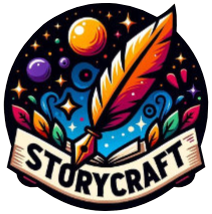
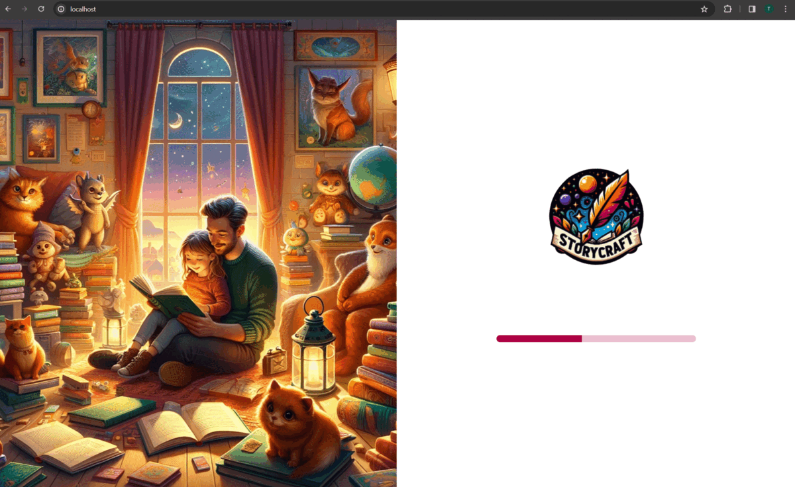
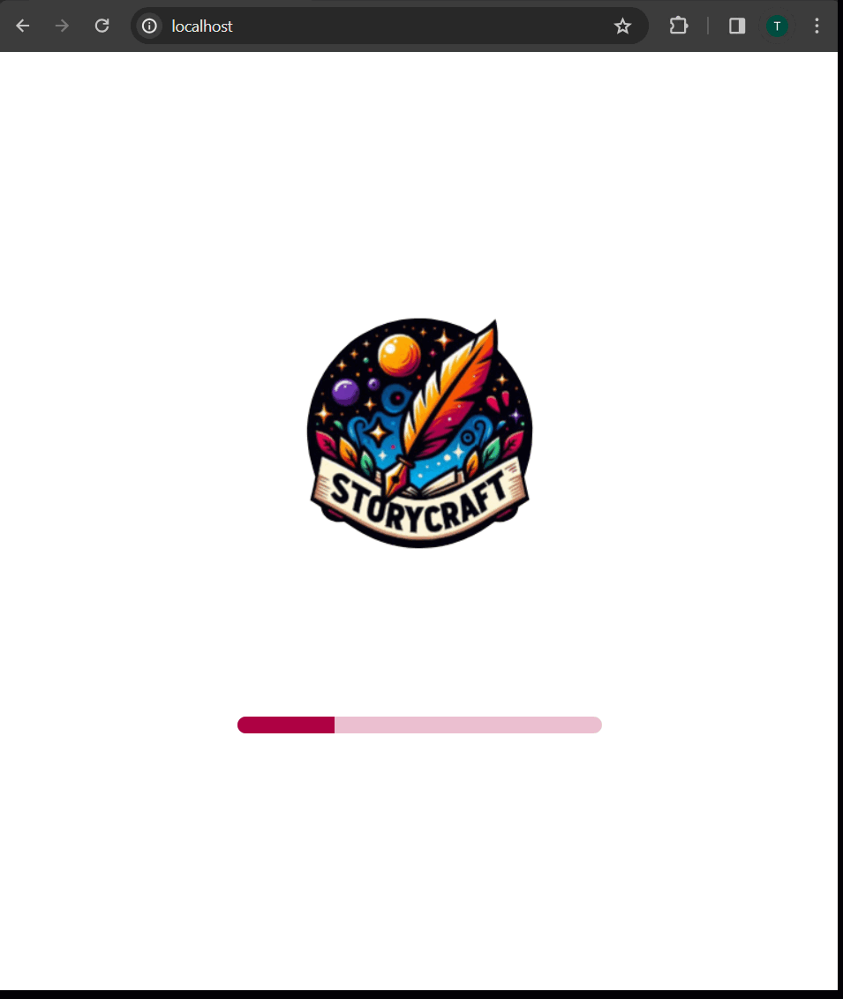
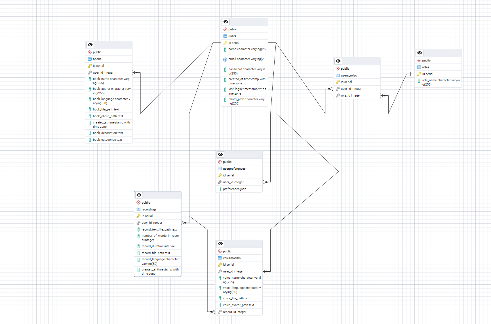

# StoryCraft - Create Personalized Audiobooks for Kids

## Project Description

StoryCraft is an innovative application that allows parents to create personalized audiobooks for their children. With this app, parents can customize the content of audiobooks to their children's preferences, record their own voices as narrations, and utilize advanced speech generation technology based on their own voices. The project aims to facilitate children's access to valuable audiovisual materials and support their language and imagination development.

## Key Features

- **Personalized Audiobook Creation**: Tailor the stories to match your child's interests and age.
- **Voice Narration Recording**: Bring stories to life with your own voice, making them more engaging for your child.
- **Content Customization**: Choose from a wide range of topics and themes to create the perfect story.
- **Interactive Audiobooks**: Engage your child with interactive elements within the stories.

## System Requirements

- Access to a modern web browser.
- Compatibility with HTML5, CSS3, and JavaScript for the best user experience.

<!-- ## GIFs showing main views of app

 -->

## Installation

The StoryCraft application is designed as a web application, meaning no installation is needed on your device. To access the application, simply navigate to the [StoryCraft website](storycraft.com) and register or log in to your account.

## Configuration

Upon logging into the application, users can adjust their preferences and settings within their user profile to enhance their experience.

## Usage

To begin enjoying StoryCraft, follow these steps:
1. Log in to your account or register for a new one.
2. Explore the collection of available audiobooks.
3. Create and customize audiobooks tailored for your child.
4. Record your narration to add a personal touch.
5. Wait for finishing voicemodel creation.
6. Enjoy the journey of stories with your child.

## ERD Diagram

## Bug Reporting

Encountered an issue or have suggestions for improvements? Please report them on the [Issues](link_to_bug_reporting_page) section of our GitHub repository.

## Support

Need help or have questions? Reach out to our support team at [support@storycraft.com](mailto:support@storycraft.com).

## License

StoryCraft is released under the [MIT License](LICENSE).

---

We appreciate your interest in StoryCraft! Together, let's create magical storytelling moments for your children and foster their growth and imagination.
